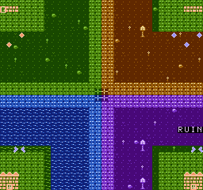

# RISC-V VSN: Four Corners

A self-contained **RV32IMF + RAM + ROM + VSN + UART** demo. Explore a 512×480
world of grass, dunes, water and ruins through a 256×240 viewport. Background
tiles scroll while butterflies patrol and gems shimmer. Press `M` to cycle the
renderer live through five VSN modes: NES graphics (2bpp), VT planar4, packed
8bpp, 16x16 packed 8bpp, and the native 512×480 high-resolution mode. The packed
modes repaint the world with a smooth screen-wide RGB555 colour gradient. All
artwork is original and generated into shared RAM by the firmware.



## Run and control

Load `project.json` in SRZ80 with the `ram`, `rom`, `riscv`, `vsn`, and
`uart_console` plugins installed, then resume the rack. The ready-to-run
`demo.rom` is included; no compiler or external graphics assets are needed.

Open the VSN video display and the console for endpoint **`vsn.uart`**. Turn on
**Live mode** in the console, focus its input field, and type:

| Key | Action |
| --- | --- |
| W / A / S / D | Move the camera up / left / down / right by 8 pixels |
| R | Return to the central crossroads (128, 120) |
| M | Cycle NES → planar4 → packed8 → packed16 → hires |
| P | Toggle the raster-interrupt split: a fixed RUINS overview band |
| ? | Print the controls |

Uppercase works too. Each character acts immediately; the newline added by
Live mode is ignored. CR, LF and CRLF never cause extra movement. Normal
line-based input also works: submit `wwdd` to move twice up and twice right.
There is no key-release protocol: each received letter is one movement step,
not a continuously held direction.

The UART prints the camera **target**, while single-precision floating-point
arithmetic smoothly moves the view toward it. Camera coordinates are the
viewport's world origin, bounded to X=0…256, Y=0…240. Moving right makes world
objects move left on screen. Animation continues when no input is sent.

The VSN surface is always 512×480. The 256×240 modes are upscaled to it with
exact nearest-neighbor 2x, while the hires mode fills it natively and shows the
entire 512×480 world at once (its camera is pinned to the origin).

## How it works

The CPU runs at 4 MHz and boots at address zero. The ROM is compiled for
`rv32imf_zicsr` / `ilp32f`; startup enables the floating-point state and initializes
`.data`/`.bss`, including after warm reset. RV32F operations implement camera
easing; integer multiplication/division use RV32M.

VSN **NES graphics mode** supplies both planar 2bpp backgrounds and sprites.
There are four standard 1 KiB nametables, each with its attribute table, using
page strides 1024 and 2048. Each page retains its original four-color background
palette. The clearing around each house uses the green background palette, while
transparent sprite tiles draw the house itself with red tones. Native VSN base
registers point directly into the RAM card; no NES CPU PPU registers are used.

The first `M` press switches to **planar4 mode** (MODE 2), VSN's native VT-style
planar renderer. The background becomes a 2bpp planar layer driven by a 16-bit
descriptor map (12-bit tile index + 4-bit palette bank) instead of NES nametables
and attributes, and the sprites become 4bpp planar tiles — the gem is redrawn as
a shaded diamond and the butterfly keeps its silhouette while gaining colour
depth. The palette switches from NES master indices to a 256-entry RGB444 table
whose first sixteen entries reproduce the four NES background banks.

The next two presses select VSN's packed 8bpp renderers. **packed8** (MODE 3)
reads one byte per pixel from a 64×60 descriptor map, and **packed16** (MODE 4)
reads 16×16 tiles from a 32×30 map. The fifth press selects **hires** (MODE 5),
which uses packed16's exact 16×16×8 tile, descriptor-map, palette and sprite
formats but renders natively at 512×480 rather than a 256×240 viewport, so the
whole world is visible at once. A fine-detail strip — a 1-pixel checkerboard,
horizontal/vertical/diagonal lines and the 1-pixel-stroke text **"HI RES"** —
sits on row 10 and is the resolution showcase: it is crisp in hires and turns
into visible 2×2 blocks in packed16, where the same tiles are upscaled. These
modes show what 8bpp plus RGB555 can
do that NES and planar4 cannot: instead of banking a handful of flat tones, the
firmware paints the world with a single continuous colour field. Entries 0–127
of the palette are a cyclic eight-stop gradient, and every world cell gets its
own tile holding that field's position at each pixel, so the screen is a genuine
smooth gradient — around 128 distinct colours on screen, against 17 in NES mode,
with dozens of distinct colours along a single scanline. The terrain's 2bpp
shapes become relief: a higher level shifts the field position, so grass, water,
roads and ruins read as ridges and channels through the gradient. packed16
rebuilds the same field from 16×16 tiles, sampling it at the finer resolution.

A packed pixel is the full palette index rather than a four-colour bank, so the
per-cell tiles are unique to their world position; nothing needs a tiled
palette-bank trick. Signs sit on the gradient through a fixed white entry, and
palette entries 128–255 hold the actors' own ramps so sprites stay legible.

Packed modes also switch the sprite table. Instead of the 256-byte NES OAM they
publish VSN's 512-byte **extended table**: 32 records of 16 bytes with signed
X/Y, a 20-bit tile index, flip/behind-background/enable flags and a size
selector. Four shaded **16×16 crystals** ring the central crossroads, one on
each of four 15-step RGB555 ramps, and each is emitted first so it always
survives the 32-record table. Their signed coordinates let them cross the
viewport edge and be clipped by VSN instead of culled by the guest. The 16×16
crystal path is the packed size-2 sprite fetch; NES and planar4 keep the
64-entry byte OAM.

The house overlays, gems, and butterflies demonstrate independent motion,
palette changes, and horizontal/vertical flips. World-space sprite positions are
converted to screen coordinates by subtracting the same camera position used for
background scrolling. Offscreen sprites are hidden; NES and planar4 cells
crossing the left/top edge are culled because that OAM has unsigned coordinates.
The optional eight-sprites-per-line limit is disabled so overlapping objects
remain visible.

Sprite descriptors use two shared-RAM tables per family: the 256-byte NES OAM
and the 512-byte extended OAM. The CPU builds each frame's records into a
staging buffer (`0x99000`), then VSN's **chunked DMA copy** uploads them into
the inactive table during visible scanout. The DMA-complete interrupt signals
the firmware when the upload lands, so the renderer never sees a partially
constructed sprite list. A delayed UART burst can postpone an update to the
next early vblank. Inputs arriving after preparation appear in the following
prepared frame.

| Address | Contents |
| --- | --- |
| `0x00000000` | Firmware ROM, below `0x10000` |
| `0x00010000`–`0x00010fff` | Four nametables and attributes |
| `0x00011000`–`0x00011fff` | Background patterns and sign font |
| `0x00012000`–`0x00012fff` | NES sprite patterns |
| `0x00013000`–`0x000130ff` | First NES OAM buffer |
| `0x00013100`–`0x0001311f` | 32 NES palette indices |
| `0x00013200`–`0x000132ff` | Second NES OAM buffer |
| `0x00013300`–`0x000150ff` | planar4 descriptor map (64×60 × 2 bytes) |
| `0x00015100`–`0x0001517f` | planar4 4bpp sprite tiles |
| `0x00015200`–`0x000153ff` | RGB444 palette (256 entries) |
| `0x00015400`–`0x000155ff` | RGB555 palette (256 entries) |
| `0x00015600`–`0x000159ff` | Two extended 512-byte OAM buffers |
| `0x00015a00`–`0x000177ff` | packed8 descriptor map (64×60 × 2 bytes) |
| `0x00017800`–`0x00017f7f` | packed16 descriptor map (32×30 × 2 bytes) |
| `0x00018000`–`0x00018aff` | packed sprite tiles and four 16×16 crystals |
| `0x00020000`–`0x0005bfff` | packed8 per-cell gradient tiles (3840 × 64 bytes) |
| `0x0005c000`–`0x00097fff` | packed16 per-cell gradient tiles (960 × 256 bytes) |
| `0x00098000`–`0x000987ff` | hires fine-detail tiles (7 × 256 bytes) |
| `0x00099000`–`0x000991ff` | sprite staging buffer (DMA upload source) |
| `0x000a0000`–`0x0010ffff` | Firmware variables, field table and stack |
| `0x10000000`–`0x1000007f` | VSN native MMIO |
| `0x10000100`–`0x10000101` | UART data and status |

A 1 MiB RAM card backs `0x10000`–`0x10ffff`. Most of it is the two per-cell
gradient tile banks — the price of a genuinely smooth screen-wide gradient
through a tile renderer. The display comes up in NES mode about 200 ms after
reset; the packed banks build for roughly another second while that first frame
stays on screen. UART's `config.base` intentionally matches its card base; that
plugin obtains its mapping address from the configuration field.

## Interrupts and DMA (phase 7)

The project enables VSN's two interrupt lines: `nmi_signal` `NMI` and
`irq_signal` `IRQ`. Vblank drives **NMI**; the RISC-V core has no NMI input, so
the firmware acknowledges the vblank cause in its frame loop and the NMI line
pulses once per frame — observable in the signal inspector. Raster compare and
DMA completion drive **IRQ**, which the RISC-V consumes as its machine-external
interrupt (`mtvec` + `mie.MEIE` + `mstatus.MIE`).

Pressing **P** arms a raster compare at scanline 184. When the line is reached,
the IRQ handler switches the scroll to the fixed RUINS corner (`256,240`) and
hides the sprite layer, so the bottom 56 lines show a clean map overview while
the top of the frame keeps the live player view; the frame loop restores both
in vblank. The handler acknowledges each cause with a write-one-to-clear of the
pending register, so the shared IRQ line deasserts once every cause is served.
The split works in every mode: the 256×240 modes scroll the bottom band to a
second quadrant of the world, while hires mode (whose view already spans the
whole 512×480 world) wraps the background by the same offset so the seam is
still clearly visible.

The sprite tables are uploaded with VSN **DMA**: the firmware fills each OAM
buffer at boot with a DMA **fill** (a `0xff` Y byte hides a NES sprite), and
every frame a DMA **copy** blits the just-built staging buffer into the active
OAM table, advancing 16 bytes per scanline. The DMA-complete cause drives IRQ,
and the handler sets a flag the frame loop awaits before publishing the table —
so the upload is interrupt-driven rather than polled.

## Rebuild

Install GNU bare-metal RISC-V GCC/binutils, then run from this directory:

```sh
./build_rom.sh
```

`RISCV_PREFIX` overrides the default `riscv64-unknown-elf-` tool prefix. The
script also works from other working directories. It uses the repository's
ignored `scratch/riscv-vsn` directory for temporary objects; `SRZ80_SCRATCH_DIR`
can override that location. No libc, math library or asset-download step is
needed. `demo.c` contains the art, controls and animation; `linker.ld` keeps
firmware variables clear of the 1 MiB card's asset region.

Code and original artwork are MIT licensed under the repository license.
